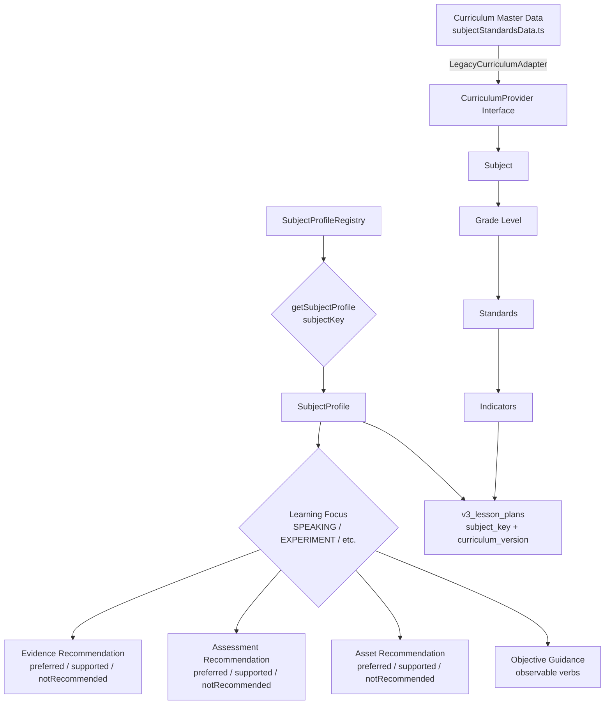
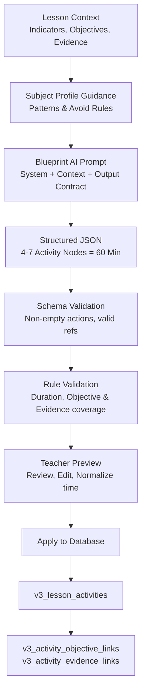
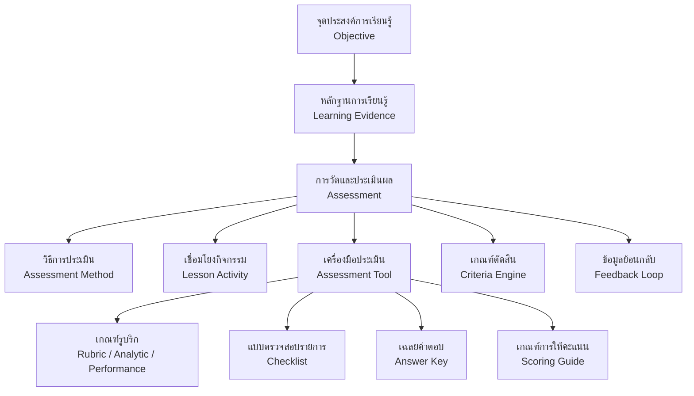
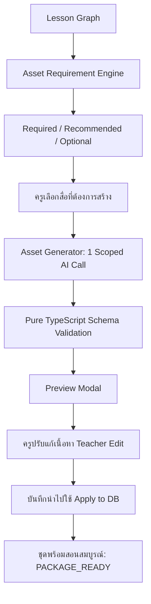

# SMART PLAN V3 ARCHITECTURE & SYSTEM AUDIT INVENTORY
**Wave V3.0 System Audit, Component Inventory & V3 Target Architecture**  
*Document Version: 3.0.0 | Date: 2026-09-28*

---

## 1. Executive Summary

ระบบ **Smart Plan V3** ได้รับการยกระดับจากเดิมที่เป็น "AI Lesson Plan Generator" (เครื่องมือช่วยร่างแผน 5 Tabs) สู่ **"PA-Ready Teaching Package Builder"** ที่รองรับการสร้างแผนการจัดการเรียนรู้ 1 ชั่วโมง (60 นาที) ควบคู่กับชุดสื่อการสอน (Worksheet, Activity Sheet, Teacher Guide, Assessment Tools) และเอกสารหลักฐานสำหรับประเมินวิทยฐานะตามเกณฑ์ วPA โดยยึดหลัก:

$$\text{Objective} \longrightarrow \text{Evidence} \longrightarrow \text{Activity} \longrightarrow \text{Assessment} \longrightarrow \text{Teaching Assets}$$

**นโยบายการพัฒนา (Non-Destructive Development):**
- ไม่ลบหรือแก้ไขโครงสร้างตารางเดิมในฐานข้อมูล Supabase (`LessonPlans`, `UnitPlans` ฯลฯ)
- ไม่แก้ไขพฤติกรรมของ Production Routes เดิม (`/plan`, `/plan/new`, `/plan/[id]`, `/dashboard`)
- ฟังก์ชัน V3 จะทำงานควบคู่ (Side-by-side) ภายใต้ Routing `/plan/v3/*` ผ่านการควบคุมด้วย Feature Flag `SMART_PLAN_V3`
- ข้อมูลแผนเดิมสามารถเปิดดูและแก้ไขได้เหมือนเดิม 100%

---

## 2. Current Architecture Inventory (ระบบปัจจุบัน)

### 2.1 Technology Stack
- **Framework:** Next.js 14.2.3 (App Router, Server Components + Client Components)
- **Database & Auth:** Supabase (PostgreSQL 15, Row Level Security, Auth via SSR Cookies)
- **Styling:** Tailwind CSS V4 + Vanilla CSS Modules (`styles/globals.css`)
- **AI Engine:** Google Gemini 2.5 Flash API (Server-side via `@/lib/geminiClient.ts` และ Key Pool)
- **Icons & UI:** Lucide React, Framer Motion, React Hot Toast
- **Export Engine:** Native HTML-to-Doc (.docx) generator with TH Sarabun New styling & CSS Paged Media A4 PDF Preview

---

### 2.2 Current Database Schema & Tables Inventory

| ตาราง (Table Name) | บทบาท / หน้าที่ | โครงสร้างหลัก (Key Columns) | สถานะใน V3 |
| :--- | :--- | :--- | :--- |
| **`LessonPlans`** | ตารางเก็บแผนการสอนหลัก (Legacy) | `planId` (PK VARCHAR), `user_id` (UUID), `planStatus`, `gradeLevel`, `subjectName`, `lessonTopic`, `essentialConcept`, `objectiveK/P/A`, `learningProcess`, `measureK/P/A`, `methodK/P/A`, `toolK/P/A`, `criteriaK/P/A`, `rubricK/P/A`, `resultK/P/A`, `problems`, `solutions` | **Maintain** (อ่าน/เขียนของเดิมได้ ไม่ลบ) |
| **`profiles`** | บัญชีและบทบาทผู้ใช้งาน | `id` (PK UUID), `email`, `full_name`, `role` (`teacher` / `admin`), `school_name` | **Reuse 100%** |
| **`UnitPlans`** | แผนการจัดการเรียนรู้รายหน่วย (V2) | `unitPlanId`, `user_id`, `unitPlanStatus`, `gradeLevel`, `subjectName`, `unitName`, `indicatorIds` (JSONB) | **Reuse & Link** |
| **`UnitLessons`** | แผนย่อยในหน่วย (Sequence) | `unitLessonId`, `unitPlanId`, `lessonPlanId`, `lessonOrder`, `lessonTitle`, `estimatedHours` | **Reuse & Link** |
| **`UnitAssessments`** | ผังการประเมินประจำหน่วย | `unitAssessmentId`, `unitPlanId`, `assessmentType`, `method`, `tool`, `criteria` | **Reuse Reference** |
| **`Rubrics`** | คลังรูบริกส่วนกลาง | `rubricId`, `user_id`, `ownerScope`, `rubricName`, `criteriaJson` (JSONB) | **Reuse** |
| **`evaluation_jobs`** | คิวงานตรวจคุณภาพแผน (วPA) | `id`, `lesson_plan_id`, `user_id`, `evaluation_mode`, `status`, `final_score`, `metadata` | **Reuse & Extend** |
| **`evaluation_results`**| ผลประเมินรายตัวชี้วัด (วPA 8 ด้าน)| `id`, `job_id`, `section`, `score`, `evidence_found`, `suggestions`, `issues` | **Reuse** |
| **`lesson_plan_issues`**| ประเด็นข้อผิดพลาดของแผน | `id`, `job_id`, `lesson_plan_id`, `severity`, `issue_type`, `title`, `description` | **Reuse** |
| **`ai_training_examples`**| คลังตัวอย่างแผนสำหรับ Prompt | `id`, `example_name`, `example_content` (JSONB), `is_active` | **Reuse Prompt Context** |
| **`ai_best_practices`**| ประวัติข้อผิดพลาดในอดีต (Memory)| `id`, `category`, `title`, `solution_pattern` | **Reuse Context** |

---

### 2.3 Current UI / Forms Inventory

1. **`PlanForm.tsx` (Legacy 5-Tabs):**
   - **Tab 1: ข้อมูลวิชาและรายคาบ** (กลุ่มสาระ, ระดับชั้น, รหัสวิชา, หน่วย, เรื่อง, จำนวนชั่วโมง)
   - **Tab 2: สาระสำคัญและตัวชี้วัด** (สาระสำคัญ, ตัวชี้วัดระหว่างทาง/ปลายทาง, สมรรถนะ, คุณลักษณะ)
   - **Tab 3: จุดประสงค์และเนื้อหา** (K/P/A, ทักษะศตวรรษที่ 21, สาระการเรียนรู้, สื่อ, แหล่งเรียนรู้, ชิ้นงาน)
   - **Tab 4: กระบวนการและการวัดผล** (Active Learning Steps, การวัดประเมินผล K/P/A, Rubrics 5 ระดับ)
   - **Tab 5: บันทึกหลังสอน** (ผลการสอน K/P/A, ปัญหา/อุปสรรค, ข้อเสนอแนะ/แนวทางแก้ไข)
2. **`app/plan/[id]/preview/page.tsx`:**
   - หน้ารองรับการแสดงผล A4 Layout เสมือนจริง ซูมเข้า-ออกได้ พิมพ์ออกเครื่องพิมพ์หรือบันทึกเป็น PDF ได้ทันที

---

### 2.4 Current API & AI Endpoints Inventory

- **Plan CRUD:**
  - `GET /api/plans` — รายการแผนการสอนทั้งหมดของผู้ใช้ (หรือของทุกคนกรณีเป็นแอดมิน)
  - `POST /api/plans` — บันทึกแผนการสอนใหม่ พร้อมตรวจสอบ Payload
  - `GET /api/plans/[id]` — ดึงข้อมูลแผนการสอน 1 รายการ
  - `PUT /api/plans/[id]` — อัปเดตแผนการสอน
  - `DELETE /api/plans/[id]` — ลบแผนการสอน
- **Master Data:**
  - `GET /api/initial-data` — ดึงข้อมูลวิชา, หน่วย, ตัวชี้วัด, และตัวเลือกพื้นฐาน (BasicOptions)
  - `GET /api/curriculum/...` — ข้อมูลตัวชี้วัดตามระดับชั้นและกลุ่มสาระ
- **Export Routes:**
  - `GET /api/plans/[id]/export/word` — ส่งออกเป็นไฟล์ Word (.doc / .docx) มีตาราง Rubric 5 ระดับ
  - `GET /api/plans/[id]/export/pdf` — ส่งออกไฟล์ PDF ผ่าน Supabase Storage
- **AI Endpoints (Gemini 2.5):**
  - `POST /api/ai` — Autofill แผนการสอนทั้งฉบับ
  - `POST /api/ai-process` — สร้างกระบวนการเรียนรู้ Active Learning
  - `POST /api/ai-completion-k` / `-p` / `-a` — เสนอจุดประสงค์และการวัดผลรายด้าน
  - `POST /api/ai-completion-reflection` — ช่วยสรุปบันทึกหลังสอน
  - `POST /api/ai-evaluate-pa8` / `POST /api/ai-evaluate-v4` — ประเมินตามเกณฑ์ วPA

---

## 3. Reusable vs. Legacy Components Analysis

| Component / Asset | หมวดหมู่ | แนวทางการจัดการใน V3 | เหตุผลทางสถาปัตยกรรม |
| :--- | :---: | :--- | :--- |
| `lib/subjectStandardsData.ts` | **Master Data** | **Reuse 100%** | ข้อมูลมาตรฐานและตัวชี้วัดของ สพฐ. สมบูรณ์อยู่แล้ว ห้ามให้ AI คิดเอง |
| `lib/geminiClient.ts` | **Infrastructure** | **Reuse 100%** | มีระบบ Retry, Fallback, Key Rotation และ Timeout Handling พร้อมใช้งาน |
| `utils/supabase/*` | **Auth & Database** | **Reuse 100%** | Middleware, Server/Client SSR Session รองรับการใช้งานอย่างปลอดภัย |
| `lib/activeLearningFramework.ts` | **Domain Logic** | **Reuse & Extend** | มีเทมเพลตกระบวนการเรียนรู้ 5 ขั้น, 2W3P, Inquiry-based นำมาแปลงเป็น 60-Min Timeline ได้ |
| `app/api/plans/[id]/export/word` | **Export Engine** | **Reuse Logic** | มีโค้ดจัดหน้า Sarabun New, 2 คอลัมน์ และตาราง Rubric ที่เสถียร |
| `app/plan/PlanForm.tsx` (5 Tabs) | **Legacy Form** | **Keep Legacy / Create V3 Separately** | ไม่แก้ไฟล์นี้โดยตรง เพื่อให้ครูที่คุ้นเคยกับฟอร์มเดิมใช้งานต่อได้โดยไม่มีสะดุด |
| Flat Columns (`measureK`, `toolK`) | **Legacy Schema** | **Adapter Pattern** | ใน V3 จะใช้ Relational Entities แต่จะมี Data Adapter แปลงกลับลง Flat Columns เพื่อความเข้ากันได้ |

---

## 4. Technical Debt & Identified Risks

1. **Flat Schema Limitation:** ตาราง `LessonPlans` เดิมเก็บ `objectiveK`, `measureK`, `rubricK` เป็น Text ก้อนเดียว ทำให้ยากต่อการ cross-reference แบบ 1:1 ระหว่าง Objective $\leftrightarrow$ Evidence $\leftrightarrow$ Assessment
2. **AI Free-form Output Risk:** Endpoint AI เดิมบางตัวคืนค่าเป็นข้อความ Markdown แบบยาว เสี่ยงต่อการ Parse ผิดพลาดในบางจังหวะ
3. **Time Calculation Integrity:** ระบบเดิมให้ครูกรอกจำนวนชั่วโมง แต่ไม่ได้บังคับคำนวณเวลากิจกรรมย่อย (เช่น 5 + 15 + 25 + 10 + 5 = 60 นาที) แบบเรียลไทม์
4. **Single-Lesson Packaging Gap:** ขาดการจัดชุดเอกสารคู่ขนาน (Teacher Package vs Student Package) เช่น ใบงานไม่มี Answer Key แยกชุด

---

## 5. V3 Architecture & Migration Strategy

### 5.1 The 7-Step Workflow Architecture (V3 UI)
```text
Step 1: Setup (กลุ่มสาระ, ระดับชั้น, วิชา, หน่วย, เรื่อง, ความยาว 60 นาที)
   ↓
Step 2: Learning Goals (ตัวชี้วัดจริง สพฐ. → 2-3 Objectives → Observable Evidence)
   ↓
Step 3: Learning Design (Lesson Blueprint 60 นาที: Warm-up, Learn, Practice, Production, Wrap-up)
   ↓
Step 4: Assessment Engine (Objective → Evidence → Method → Tool → Observable Rubric Criteria)
   ↓
Step 5: Teaching Package (Worksheet, Task Card, Teacher Guide, Answer Key)
   ↓
Step 6: Quality Review (Layer 1 Rule Engine ตรวจความครบถ้วน + Layer 2 AI Qualitative Review)
   ↓
Step 7: Documents & Export (Unified Document Model → A4 Print Preview / Word / PDF Export)
   ↓
[Post-Teaching Workflow]: Mark as Taught → บันทึกผลจริงตามสภาพจริง → Student Evidence
```

### 5.2 Additive Data Model (Target V3 Schema via Migration 15+)
ใน Wave V3.1 จะสร้างตารางเสริมแบบ 1:N (ไม่ลบและไม่แก้ `LessonPlans`):
- `v3_lesson_objectives` (`id`, `plan_id`, `code`, `statement`, `type`, `observable_behavior`)
- `v3_learning_evidence` (`id`, `objective_id`, `evidence_type`, `description`)
- `v3_lesson_activities` (`id`, `plan_id`, `phase`, `minutes`, `teacher_action`, `student_action`, `linked_objective_ids`)
- `v3_assessments` (`id`, `evidence_id`, `method`, `tool_type`, `criteria_type`, `rubric_id`)
- `v3_teaching_assets` (`id`, `plan_id`, `asset_type`, `title`, `content_json`, `target_audience`)
- `v3_post_teaching_records` (`id`, `plan_id`, `students_total`, `students_passed`, `reflection`)

### 5.3 Compatibility & Backward Compatibility Layer
- แผนการสอนเดิมที่เปิดใน V3 จะถูกอ่านผ่าน **Legacy Adapter** เพื่อจำลองโครงสร้าง V3 ในโหมดอ่าน
- แผนที่สร้างใน V3 สามารถซิงก์สรุปผลกลับลงตาราง `LessonPlans` ได้ ทำให้หน้า Dashboard เดิมและ Export เดิมยังทำงานได้

---

## 6. Dependency & Routing Map

```
/ (Landing Page)
├── /dashboard (Dashboard เดิม - แสดงรายการแผน)
├── /plan
│   ├── /new (Legacy 5-Tab Form)
│   ├── /[id] (Legacy Edit Form)
│   └── /[id]/preview (Legacy Preview)
└── /plan/v3 [NEW V3 ROUTE]
    ├── page.tsx (V3 Hub & Overview)
    ├── /new (7-Step Teaching Package Creator Shell)
    └── /[id] (V3 Teaching Package Editor View)
```

---

## 7. Acceptance Verification for Wave V3.0

- [x] ตรวจสอบ Inventory ระบบเดิมครบถ้วน (Schema, APIs, Form, AI Endpoints, Export, Preview, Auth)
- [x] สร้าง Feature Flag `lib/featureFlags.ts` ควบคุม `SMART_PLAN_V3`
- [x] สร้าง Routes ใหม่ของ V3: `/plan/v3`, `/plan/v3/new`, `/plan/v3/[id]` โดยไม่กระทบ Route เดิม
- [x] สร้างเอกสาร `docs/SMART_PLAN_V3_ARCHITECTURE.md`
- [x] ตรวจสอบความถูกต้องของ TypeScript, Build, และ Lint

---

## 8. V3.1 Actual Database Model

ใน Wave V3.1 ระบบได้สร้าง Schema ใหม่ที่รองรับ Domain Graph:
$$\text{Objective} \xleftrightarrow{\text{M:N}} \text{Evidence} \xleftrightarrow{\text{M:N}} \text{Assessment}$$
และ
$$\text{Activity} \xleftrightarrow{\text{M:N}} \text{Objective} \quad \text{and} \quad \text{Activity} \xleftrightarrow{\text{M:N}} \text{Evidence}$$

### 8.1 Entity Relationship Diagram (ERD)


### 8.2 Isolation & Non-Destructive Invariants
1. **Isolated Namespace**: ทุกตารางใช้ prefix `v3_` โดยไม่ไปแตะต้อง `LessonPlans`, `UnitPlans`, `Rubrics`
2. **Cascade Behavior**: เมื่อลบ Objective จะลบเฉพาะ junction link `v3_objective_evidence_links` ไม่ลบ Evidence ที่แชร์กับ Objective อื่น
3. **Owner-Only RLS**: ทุก child table ตรวจสิทธิ์ผ่าน `v3_lesson_plans.user_id = auth.uid()` ป้องกันการเข้าถึงข้ามบัญชี 100%

---

## 9. WAVE V3.2 — Curriculum Engine & Subject Profile Engine

*Added: 2026-09-28 | AI CALLS: 0*

### 9.1 Design Goals

Wave V3.2 แยก 2 เรื่องออกจากกันชัดเจน:

| Engine | ตอบคำถาม | Source |
| :--- | :--- | :--- |
| **Curriculum Engine** | หลักสูตรอะไร / วิชาอะไร / ชั้นไหน / มาตรฐาน/ตัวชี้วัดใด | Static Master Data (`subjectStandardsData.ts`) ผ่าน Adapter |
| **Subject Profile Engine** | วิชานี้ควรออกแบบการเรียนรู้แบบใด / หลักฐานแบบใด / ประเมินอย่างไร | Deterministic TypeScript Configuration (ไม่มี AI) |

### 9.2 Module Structure

```text
lib/smartPlanV3/
├── curriculum/
│   ├── types.ts              — CurriculumProvider interface + data shapes
│   ├── legacyDataAdapter.ts  — implements CurriculumProvider from subjectStandardsData.ts
│   ├── provider.ts           — singleton + cached index (Subject → Grade → Standards → Indicators)
│   └── index.ts              — public exports
│
└── subjectProfiles/
    ├── types.ts              — SubjectProfile, LearningFocusConfig, RecommendationTier
    ├── english.ts
    ├── thai.ts
    ├── mathematics.ts
    ├── science.ts
    ├── socialStudies.ts
    ├── health.ts
    ├── physicalEducation.ts
    ├── art.ts
    ├── career.ts
    ├── registry.ts           — PROFILE_REGISTRY + helper functions + validateAllProfiles()
    └── index.ts
```

### 9.3 Curriculum Data Coverage

| ข้อมูล | ปัจจุบัน |
| :--- | :--- |
| Curriculum Version | OBEC-2551-REV60 (หลักสูตร 2551 ปรับปรุง 2560) |
| Subject-Grade entries | 84 |
| Standards (`{ code: }`) | ~489 |
| Indicators groups | ~84+ |
| Missing | มัธยมปลาย (ม.4–6) ไม่สมบูรณ์บางวิชา |

### 9.4 Subject Profiles Implemented

| Profile Key | วิชา | Learning Focuses |
| :--- | :--- | :--- |
| `ENGLISH` | ภาษาต่างประเทศ | SPEAKING, LISTENING, READING, WRITING, LANGUAGE_USE, INTEGRATED |
| `THAI` | ภาษาไทย | READING, WRITING, LISTENING_VIEWING, SPEAKING, LANGUAGE, LITERATURE |
| `MATHEMATICS` | คณิตศาสตร์ | CALCULATION, PROBLEM_SOLVING, CONCEPT, REASONING, MATHEMATICAL_COMMUNICATION |
| `SCIENCE` | วิทยาศาสตร์ | CONCEPT, INQUIRY, EXPERIMENT, DATA_ANALYSIS, SCIENTIFIC_EXPLANATION, ENGINEERING_DESIGN |
| `SOCIAL_STUDIES` | สังคมศึกษาฯ | HISTORY, RELIGION_ETHICS, CIVICS, ECONOMICS, GEOGRAPHY |
| `HEALTH` | สุขศึกษา | HEALTH_KNOWLEDGE, DECISION_MAKING, LIFE_SKILLS, HEALTH_BEHAVIOR |
| `PHYSICAL_EDUCATION` | พลศึกษา | MOVEMENT_SKILL, SPORT_SKILL, PHYSICAL_FITNESS, TEAM_PLAY |
| `ART` | ศิลปะ | VISUAL_ART, MUSIC, PERFORMING_ARTS |
| `CAREER` | การงานอาชีพ | WORK_PROCESS, PRACTICAL_SKILL, DESIGN_MAKING, CAREER_EXPLORATION |

### 9.5 Recommendation Flow



### 9.6 API Routes (Read-Only)

```text
GET /api/plan/v3/curriculum/versions
GET /api/plan/v3/curriculum/subjects?curriculumVersion=...
GET /api/plan/v3/curriculum/standards?subject=...&grade=...
GET /api/plan/v3/curriculum/indicators?subject=...&grade=...&standard=...

GET /api/plan/v3/subject-profiles
GET /api/plan/v3/subject-profiles/[key]?focus=SPEAKING
```

### 9.7 Deterministic Rule Examples

| Subject + Focus | Evidence (preferred) | Assessment (preferred) | Anti-pattern |
| :--- | :--- | :--- | :--- |
| English + SPEAKING | SPEAKING, PERFORMANCE | PERFORMANCE_RUBRIC, OBSERVATION | ANSWER_KEY เป็น primary |
| Math + CALCULATION | WORKSHEET, QUIZ | ANSWER_KEY, SCORING_GUIDE | PERFORMANCE_RUBRIC |
| Math + PROBLEM_SOLVING | WRITTEN_SOLUTION, PROBLEM_SET | SCORING_GUIDE, ANALYTIC_RUBRIC | SIMPLE_ANSWER_KEY |
| Science + EXPERIMENT | EXPERIMENT, OBSERVATION, DATA_TABLE | CHECKLIST, RUBRIC | ANSWER_KEY |
| PE + SPORT_SKILL | PERFORMANCE, OBSERVATION | PERFORMANCE_RUBRIC, CHECKLIST | WRITTEN_EXAM |
| Social Studies + HISTORY | HISTORICAL_INQUIRY_REPORT, TIMELINE | ANALYTIC_RUBRIC | ROTE_MEMORIZATION |
| Social Studies + RELIGION_ETHICS | CASE_STUDY_REFLECTION, BEHAVIORAL_OBSERVATION | BEHAVIORAL_CHECKLIST | HISTORICAL_TIMELINE |

---

## 10. Wave V3.4 — 60-Minute Lesson Blueprint & Activity Engine

### 10.1 Core Architecture & Principle
Smart Plan V3 แปลงจากระบบเดิมที่สั่ง AI เขียนความเรียงยาวๆ มาเป็นระบบ **Structured Lesson Blueprint & Activity Engine** ที่รับประกันความสอดคล้องตามลำดับชั้น:

```text
Curriculum → Indicators → Subject Profile → Learning Focus → Objectives → Evidence → Activity Nodes
```



### 10.2 Privacy & Data Minimization
- ห้ามส่งข้อมูลครู (user UUID, email) หรือข้อมูลนักเรียนไปยัง Gemini API
- ใช้ Temporary Token Mapping (เช่น `O1`, `O2`... สำหรับ Objectives และ `E1`, `E2`... สำหรับ Evidence) ในระหว่างเรียก AI
- ฝั่ง Server แปลง Tokens กลับเป็น Database UUID จริงอย่างปลอดภัย พร้อมตัด/ตรวจจับ Hallucinated References (เช่น `O99`)

### 10.3 Extensible Phase Model
รองรับเฟสกิจกรรมที่ยืดหยุ่นตามธรรมชาติวิชา:
`ENGAGE`, `EXPLORE`, `LEARN`, `MODEL`, `PRACTICE`, `APPLY`, `PERFORM`, `DISCUSS`, `INVESTIGATE`, `CREATE`, `ASSESS`, `REFLECT`, `SUMMARIZE`, `OTHER`

### 10.4 Deterministic Time & Rule Engine
- **Time Engine:** คำนวณ `sum(minutes)` เทียบกับเวลาคาบ (เช่น 60 นาที) พร้อมฟังก์ชัน `suggestTimeNormalization` ที่เสนอการปรับเวลาในกิจกรรมหลักโดยไม่ต้องเรียก AI ซ้ำ
- **Coverage Rules:** ตรวจสอบว่าทุก Objective ถูกครอบคลุมด้วยกิจกรรมอย่างน้อย 1 กิจกรรม และหลักฐานสำคัญถูกฝึกหรือสังเกต
- **Workflow Status Derivation:** ยกระดับสถานะแผนเป็น `BLUEPRINT_READY` อัตโนมัติเมื่อครบ 60/60 นาที กิจกรรม > 0 และครอบคลุมทุกจุดประสงค์ หากครูลดเวลาหรือลบกิจกรรมจะ Downgrade กลับเป็น `DRAFT` อย่างแม่นยำ

### 10.5 Activity CRUD & Partial Regeneration
- รองรับการสร้าง Manual, แก้ไข (PATCH), ลบ (DELETE), และสลับตำแหน่ง (Reorder Up/Down)
- รองรับ **Partial Regeneration:** ร้องขอแนวทางกิจกรรมใหม่เฉพาะจุด (1 กิจกรรม) โดยส่งบริบทกิจกรรมก่อนหน้าและถัดไป เพื่อให้ครูเลือกเปรียบเทียบก่อน Apply โดยไม่รื้อกิจกรรมทั้งคาบ

---

## 11. Wave V3.5 — Assessment Engine

### 11.1 Pedagogical Alignment Architecture
Wave V3.5 ยึดหลักการประเมินตามสภาพจริงที่ขับเคลื่อนด้วยหลักฐาน (Evidence-Driven Assessment):



### 11.2 Assessment Entity vs. Assessment Tool
- **Assessment Entity (`v3_assessments`):** กำหนด "การประเมินอะไร ด้วยวิธีใด ในช่วงเวลาใด (Formative vs Summative) และใช้เกณฑ์ตัดสินอย่างไร"
- **Assessment Tool (`v3_assessment_tools`):** กำหนด "เนื้อหารายละเอียดของเครื่องมือ" (JSON Content เช่น ตาราง Rubric Descriptors, รายการ Checklist, เกณฑ์คะแนนย่อย Scoring Guide)
- **Traceability:** ยึดโยง Objective ↔ Evidence ↔ Assessment โดยตรง โดยไม่ต้อง duplicate direct Objective link ซ้ำซ้อน

### 11.3 Deterministic Recommendation Rules
ระบบเลือกวิธีประเมินและเครื่องมือตาม Subject Profile + Learning Focus + Evidence Type โดยใช้ Code Rule Engine:
- **English Speaking:** แนะนำ `PERFORMANCE` + `PERFORMANCE_RUBRIC` / `OBSERVATION_FORM` (ไม่ใช้ Answer Key เป็นตัวหลัก)
- **English Vocabulary Quiz:** แนะนำ `QUIZ` + `ANSWER_KEY`
- **Math Calculation:** แนะนำ `WRITTEN_RESPONSE` + `ANSWER_KEY` / `SCORING_GUIDE` (ไม่ default Rubric)
- **Math Problem Solving:** แนะนำ `WRITTEN_RESPONSE` / `PERFORMANCE` + `SCORING_GUIDE` / `RUBRIC` (รองรับคำตอบ กระบวนการ และการให้เหตุผล Reasoning)
- **Science Experiment:** แนะนำ `OBSERVATION` + `CHECKLIST` / `OBSERVATION_FORM`
- **PE Skill:** แนะนำ `PERFORMANCE` + `CHECKLIST` / `PERFORMANCE_RUBRIC`

### 11.4 Criteria Engine
รองรับรูปแบบเกณฑ์ตัดสินที่หลากหลายตามธรรมชาติของเครื่องมือ:
- `PERCENTAGE` (เช่น ≥ 70%)
- `SCORE_THRESHOLD` (เช่น ≥ 8 / 10 คะแนน)
- `ITEMS_PASSED` (เช่น ผ่านอย่างน้อย 4 ใน 5 รายการ)
- `RUBRIC_LEVEL` (เช่น ระดับ 3 ขึ้นไป)
- `PASS_FAIL`
- `CUSTOM`

### 11.5 AI Policy in Assessment Engine
- **AI บทบาทเดียว:** ช่วยร่างคำอธิบายระดับคุณภาพ (Descriptors) หรือข้อความพฤติกรรมที่สังเกตได้ (1 Scoped Request ต่อ 1 เครื่องมือ)
- **ห้าม AI:** ห้ามเลือกประเภท Assessment, ห้ามเลือกประเภทเครื่องมือ, ห้ามสร้าง Rubric K/P/A อัตโนมัติ, ห้ามคำนวณเกณฑ์ผ่าน หรือตรวจความพร้อม
- **Preview First:** เครื่องมือที่ AI ร่างจะแสดงในหน้าต่าง Preview ให้ครูตรวจสอบและปรับแก้ในตารางได้อิสระก่อนบันทึกลงฐานข้อมูล

---

## 12. Wave V3.6 — Teaching Package Builder

### 12.1 Core Architectural Flow
Wave V3.6 เปลี่ยน Smart Plan จาก "Lesson Plan Builder" เป็น **"PA-Ready Teaching Package Builder"** โดยใช้กราฟข้อมูลทั้งหมด (Indicators → Objectives → Evidence → Activities → Assessment → Assessment Tools) มาสร้างเฉพาะสื่อที่จำเป็นต่อคาบนั้นจริง:



### 12.2 Deterministic Asset Requirement Engine
- **โมดูล:** `lib/smartPlanV3/rules/teachingAssetRules.ts`
- **Zero AI for Requirements:** ระบบจำแนกความต้องการสื่อเป็น 4 หมวด: `required`, `recommended`, `optional`, `notNeeded` โดยพิจารณาจาก Subject Profile + Learning Focus + Activity Hints + Evidence + Assessment
- **Priority:** Assessment requirement > Activity requirement > Subject recommendation
- **Deduplication:** หากกิจกรรมหลายช่วงระบุสื่อประเภทเดียวกัน (เช่น Speaking Card ในกิจกรรมที่ 2 และ 3) ระบบจะรวมเป็น 1 รายการสื่อ ไม่สร้างซ้ำซ้อน
- **ความสอดคล้องตามธรรมชาติวิชา:**
  - *English Speaking:* ต้องการ `SPEAKING_CARD` (Student) + Reuse `ASSESSMENT_FORM` (Teacher), ไม่บังคับ Worksheet
  - *Math Problem Solving:* ต้องการ `PROBLEM_SET` (Student, มีสถานการณ์และพื้นที่แสดงวิธีคิด/เหตุผล) + `ANSWER_KEY` (Teacher)
  - *Math Calculation:* ต้องการ `PROBLEM_SET` / `WORKSHEET` + `ANSWER_KEY`
  - *Science Experiment:* ต้องการ `EXPERIMENT_SHEET` + `DATA_TABLE` + Reuse `ASSESSMENT_FORM`
  - *Physical Education:* ต้องการ `TASK_CARD` (Student) + Reuse `ASSESSMENT_FORM`, ใบงานข้อเขียนถูกจัดเป็น `notNeeded`
  - *Art:* ต้องการ `ACTIVITY_SHEET` (Planning Sheet / Product Brief), แบบทดสอบปรนัยถูกจัดเป็น `notNeeded`

### 12.3 Answer Key Guard & Prerequisite Enforcement
- **Answer Key Guard:** การสร้างเฉลย (Answer Key) จะถูกบล็อกหากยังไม่มี Worksheet / Problem Set ที่บันทึกเนื้อหาลงระบบแล้ว
- **Assessment Tool Reuse:** ห้ามสร้าง Rubric หรือ Checklist ซ้ำใน Teaching Assets หากมีอยู่แล้วในขั้นที่ 4 ระบบจะเชื่อมโยงและนำมาใช้ซ้ำ (Reuse) โดยตรง

### 12.4 Preview-First & Teacher Empowerment
- **1 Asset = 1 Scoped Call:** ห้ามสร้างทั้งชุดพร้อมสอนในคำขอ AI เดียว เพื่อควบคุมความเสถียร ประหยัด Token และรองรับการ Regenerate เฉพาะจุด
- **Existing vs. Alternative:** เมื่อขอแนวทางใหม่ ("ขอแนวทางใหม่") ระบบจะแสดงสื่อปัจจุบันเทียบกับแนวทางใหม่ ให้ครูเลือกและแก้ไขก่อนบันทึก ห้าม AI เขียนทับของเดิมโดยไม่ได้รับอนุญาต
- **Duration Warning:** ตรวจสอบเวลาทำสื่อกับเวลากิจกรรมจริง หาก `estimatedMinutes > activityMinutes` จะแจ้งเตือนข้อผิดพลาดทันที

### 12.5 Stale Asset Detection & Package Readiness
- **Stale Detection:** `deriveAssetReviewState()` ตรวจสอบ Timestamp ของ Objective, Activity, Evidence ที่เชื่อมโยง หากมีการแก้ไขหลังจากสร้างสื่อ สื่อนั้นจะติดสถานะ `needs_review = true` พร้อมแจ้งให้ครูตรวจสอบ
- **Package Readiness:** `deriveTeachingPackageReadiness()` ตรวจสอบว่า Blueprint พร้อม, Assessment พร้อม, สื่อจำเป็นทุกชิ้นอยู่ในสถานะ `READY` และไม่มีสื่อที่ค้าง `needs_review`
- **Workflow State Transition:**
  - เมื่อสื่อจำเป็นครบถ้วน: เลื่อนสถานะจาก `BLUEPRINT_READY` $\longrightarrow$ `PACKAGE_READY`
  - หากลบสื่อจำเป็น: ปรับลดสถานะจาก `PACKAGE_READY` $\longrightarrow$ `BLUEPRINT_READY` อัตโนมัติ

---

## 13. Wave V3.7R — Quality & PA Compliance Hardening

### 13.1 Quality Summary Model (Zero Quality Score Invariant)
Wave V3.7R ปฏิรูปด่านตรวจคุณภาพกลางของระบบโดย **ยกเลิก QualityScore 0–100 และคะแนนรวมทั้งหมดออกจากระบบอย่างเด็ดขาด** (ไม่มีการใช้ 95/100, ดีเยี่ยม, หรือระดับเปอร์เซ็นต์ในการตัดสิน Workflow) โดยแทนที่ด้วย **Quality Summary Model**:

```ts
interface V3QualitySummary {
  blockingIssues: number;
  warnings: number;
  suggestions: number;
  structuralReady: boolean;
  assessmentReady: boolean;
  packageReady: boolean;
  documentReady: boolean;
}
```

UI หน้าจอขั้นที่ 6 แสดงผลเป็นสถานะความพร้อมเชิงองค์ประกอบ:
- โครงสร้าง: พร้อม
- ความสอดคล้อง: พร้อม / ควรตรวจ X จุด
- กิจกรรม: พร้อม
- การประเมิน: พร้อม
- ชุดพร้อมสอน: พร้อม

และการสรุปการ์ดประเด็น:
- **ต้องแก้ก่อนส่งออก:** จำนวนข้อผิดพลาดที่บล็อกการสร้างเอกสาร (`isBlocking = true`, `severity = ERROR`)
- **ควรตรวจสอบ:** ข้อควรระวังเชิงคุณภาพที่ไม่บล็อกการส่งออก (`severity = WARNING`)
- **ข้อเสนอแนะ:** แนวทางปรับปรุงเพิ่มเติม (`severity = INFO`)

### 13.2 Deterministic Document Readiness Function
ฟังก์ชันกลาง `deriveDocumentReadiness(graph, ruleResult)` ทำหน้าที่เป็น Gatekeeper ก่อนที่แผนจะเข้าสู่ขั้นที่ 7 (เอกสารและการส่งออก):

```text
Condition for Document Readiness:
  PACKAGE_READY
  AND blockingIssues = 0
  AND assessmentReady
  AND durationValid (เวลากิจกรรมรวมตรงกับคาบเรียน)
  AND objectiveCoverageComplete
  AND evidenceCoverageComplete
```

- **ข้อผิดพลาดที่บล็อก (Blocking Errors):** ไม่มี Objective, Objective ไม่มี Evidence, Evidence ไม่มี Assessment, Assessment ไม่มี Tool/Criteria, เวลากิจกรรมไม่ตรงคาบเรียน, ขาดสื่อการสอนที่จำเป็น (Required Asset Missing), หรือสื่อที่จำเป็นติดสถานะ Stale (`needs_review = true`)
- **ข้อผิดพลาดที่ไม่บล็อก:** คำเตือนจากการตรวจเชิงคุณภาพของ AI หรือข้อแนะนำเพิ่มเติม

### 13.3 Workflow State Transition: REVIEWED & Downgrade
- **Promotion:** เมื่อแผนอยู่ในสถานะ `PACKAGE_READY` และผ่านเงื่อนไข `deriveDocumentReadiness().ready === true` แผนจะได้รับการเลื่อนสถานะเป็น `REVIEWED` (ผ่านการตรวจคุณภาพแล้ว)
- **Downgrade:** หากแผนที่อยู่ในสถานะ `REVIEWED` ถูกแก้ไขในภายหลัง (เช่น ลบจุดประสงค์, แก้ไขเวลาจนไม่ตรงคาบ, ลบสื่อจำเป็น) จนทำให้เงื่อนไข Document Readiness ไม่ผ่าน ระบบจะปรับลดสถานะกลับเป็น `PACKAGE_READY` (หรือสถานะก่อนหน้าที่เหมาะสม) ทันที

### 13.4 Versioned PA Criteria Registry & Source Metadata
ระบบจัดโครงสร้าง PA Criteria Registry แบบ Versioned (`lib/smartPlanV3/pa/`):
- **Base Document:** หนังสือสำนักงาน ก.ค.ศ. ที่ ศธ 0206.3/ว9 ลงวันที่ 20 พฤษภาคม 2564
- **Authority:** สำนักงานคณะกรรมการข้าราชการครูและบุคลากรทางการศึกษา (ก.ค.ศ.)
- **Amendment Chain:** บันทึกและตรวจสอบประวัติหนังสือเวียนที่เกี่ยวข้อง (ว22/2564, 456/2566, 1122/2567, 1144/2567, 1683/2567, ล1222/2568, OTEPC-SUMMARY-2569)
- **Separation of Official Text vs. System Mapping:** แยกชัดเจนระหว่าง `officialLabel` / `officialCode` กับ `systemLabel` โดยระบุ `mappingType: "DIRECT" | "INTERPRETED" | "SYSTEM_QUALITY_RULE"`

### 13.5 Planned vs. Observed Distinction (Strict Invariant)
ในระยะตรวจแผนก่อนสอน (Pre-Teaching):
- ระบบมีเฉพาะ: จุดประสงค์ที่คาดหวัง, กิจกรรมที่ออกแบบ, เครื่องมือประเมินที่เตรียมไว้, และสื่อการสอน
- **สถานะ:** `evidenceStage: "PLANNED"`
- **Strict Prohibition:** ห้ามระบบและห้าม AI รายงานหรือกล่าวอ้างว่า "ผู้เรียนเกิดผลลัพธ์แล้ว", "ผู้เรียนพัฒนาขึ้นแล้ว", หรือ "ผู้เรียนบรรลุเป้าหมายแล้ว"
- **Approved Phrasing:** ใช้ถ้อยคำเชิงการวางแผน เช่น "แผนนี้ออกแบบให้...", "มีการเตรียมหลักฐานเพื่อประเมิน...", "มีเครื่องมือสำหรับเก็บผลลัพธ์..."

### 13.6 Evidence-Based PA Statuses
แทนการใช้คำว่า "ผ่าน/ไม่ผ่าน" หรือคำว่า READY/NOT_READY สำหรับเกณฑ์ PA ระบบใช้สถานะตามร่องรอยหลักฐาน:
- `EVIDENCED` (มีหลักฐานในแผน — **ต้องมี `evidenceRefs.length >= 1` เสมอ**)
- `PARTIALLY_EVIDENCED` (มีหลักฐานบางส่วน)
- `NOT_EVIDENCED` (ยังไม่พบหลักฐาน)
- `NOT_APPLICABLE` (ไม่เกี่ยวข้องกับแผนนี้)

### 13.7 Scoped Apply Fix & Staleness Safety
- **Scoped Patching:** การนำข้อเสนอแนะของ AI ไปใช้ (Apply Fix) ดำเนินการทีละ Issue ผ่านขั้นตอน: ดูคำแนะนำ $\rightarrow$ ดูข้อความเดิม $\rightarrow$ ดูข้อความเสนอ $\rightarrow$ นำไปใช้ โดยแก้ไขเฉพาะ Field ของ Entity นั้นๆ (เช่น `A2.student_actions`) ห้ามแก้ไข Entity อื่น
- **Review Staleness:** เมื่อมีการแก้ไขข้อมูล ผลการตรวจเดิมของ AI จะติดสถานะ `isStale = true` ตาม Lesson Hash ทันที และระบบจะรันเฉพาะ Deterministic Rules ใหม่โดยอัตโนมัติ โดยไม่ยิงคำขอ AI ซ้ำโดยพลการ
