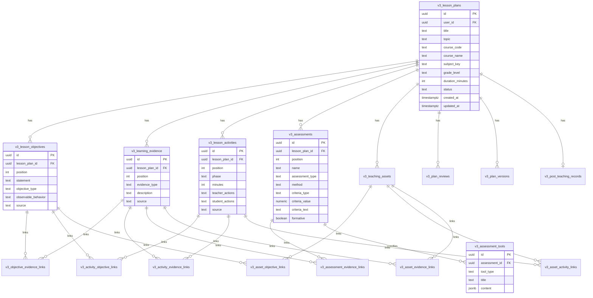

# SMART PLAN V3 ARCHITECTURE & SYSTEM AUDIT INVENTORY
**Wave V3.0 System Audit, Component Inventory & V3 Target Architecture**  
*Document Version: 3.0.0 | Date: 2026-09-28*

---

## 1. Executive Summary

ระบบ **Smart Plan V3** ได้รับการยกระดับจากเดิมที่เป็น "AI Lesson Plan Generator" (เครื่องมือช่วยร่างแผน 5 Tabs) สู่ **"PA-Ready Teaching Package Builder"** ที่รองรับการสร้างแผนการจัดการเรียนรู้ 1 ชั่วโมง (60 นาที) ควบคู่กับชุดสื่อการสอน (Worksheet, Activity Sheet, Teacher Guide, Assessment Tools) และเอกสารหลักฐานสำหรับประเมินวิทยฐานะตามเกณฑ์ วPA โดยยึดหลัก:

$$\text{Objective} \longrightarrow \text{Evidence} \longrightarrow \text{Activity} \longrightarrow \text{Assessment} \longrightarrow \text{Teaching Assets}$$

**นโยบายการพัฒนา (Non-Destructive Development):**
- ไม่ลบหรือแก้ไขโครงสร้างตารางเดิมในฐานข้อมูล Supabase (`LessonPlans`, `UnitPlans` ฯลฯ)
- ไม่แก้ไขพฤติกรรมของ Production Routes เดิม (`/plan`, `/plan/new`, `/plan/[id]`, `/dashboard`)
- ฟังก์ชัน V3 จะทำงานควบคู่ (Side-by-side) ภายใต้ Routing `/plan/v3/*` ผ่านการควบคุมด้วย Feature Flag `SMART_PLAN_V3`
- ข้อมูลแผนเดิมสามารถเปิดดูและแก้ไขได้เหมือนเดิม 100%

---

## 2. Current Architecture Inventory (ระบบปัจจุบัน)

### 2.1 Technology Stack
- **Framework:** Next.js 14.2.3 (App Router, Server Components + Client Components)
- **Database & Auth:** Supabase (PostgreSQL 15, Row Level Security, Auth via SSR Cookies)
- **Styling:** Tailwind CSS V4 + Vanilla CSS Modules (`styles/globals.css`)
- **AI Engine:** Google Gemini 2.5 Flash API (Server-side via `@/lib/geminiClient.ts` และ Key Pool)
- **Icons & UI:** Lucide React, Framer Motion, React Hot Toast
- **Export Engine:** Native HTML-to-Doc (.docx) generator with TH Sarabun New styling & CSS Paged Media A4 PDF Preview

---

### 2.2 Current Database Schema & Tables Inventory

| ตาราง (Table Name) | บทบาท / หน้าที่ | โครงสร้างหลัก (Key Columns) | สถานะใน V3 |
| :--- | :--- | :--- | :--- |
| **`LessonPlans`** | ตารางเก็บแผนการสอนหลัก (Legacy) | `planId` (PK VARCHAR), `user_id` (UUID), `planStatus`, `gradeLevel`, `subjectName`, `lessonTopic`, `essentialConcept`, `objectiveK/P/A`, `learningProcess`, `measureK/P/A`, `methodK/P/A`, `toolK/P/A`, `criteriaK/P/A`, `rubricK/P/A`, `resultK/P/A`, `problems`, `solutions` | **Maintain** (อ่าน/เขียนของเดิมได้ ไม่ลบ) |
| **`profiles`** | บัญชีและบทบาทผู้ใช้งาน | `id` (PK UUID), `email`, `full_name`, `role` (`teacher` / `admin`), `school_name` | **Reuse 100%** |
| **`UnitPlans`** | แผนการจัดการเรียนรู้รายหน่วย (V2) | `unitPlanId`, `user_id`, `unitPlanStatus`, `gradeLevel`, `subjectName`, `unitName`, `indicatorIds` (JSONB) | **Reuse & Link** |
| **`UnitLessons`** | แผนย่อยในหน่วย (Sequence) | `unitLessonId`, `unitPlanId`, `lessonPlanId`, `lessonOrder`, `lessonTitle`, `estimatedHours` | **Reuse & Link** |
| **`UnitAssessments`** | ผังการประเมินประจำหน่วย | `unitAssessmentId`, `unitPlanId`, `assessmentType`, `method`, `tool`, `criteria` | **Reuse Reference** |
| **`Rubrics`** | คลังรูบริกส่วนกลาง | `rubricId`, `user_id`, `ownerScope`, `rubricName`, `criteriaJson` (JSONB) | **Reuse** |
| **`evaluation_jobs`** | คิวงานตรวจคุณภาพแผน (วPA) | `id`, `lesson_plan_id`, `user_id`, `evaluation_mode`, `status`, `final_score`, `metadata` | **Reuse & Extend** |
| **`evaluation_results`**| ผลประเมินรายตัวชี้วัด (วPA 8 ด้าน)| `id`, `job_id`, `section`, `score`, `evidence_found`, `suggestions`, `issues` | **Reuse** |
| **`lesson_plan_issues`**| ประเด็นข้อผิดพลาดของแผน | `id`, `job_id`, `lesson_plan_id`, `severity`, `issue_type`, `title`, `description` | **Reuse** |
| **`ai_training_examples`**| คลังตัวอย่างแผนสำหรับ Prompt | `id`, `example_name`, `example_content` (JSONB), `is_active` | **Reuse Prompt Context** |
| **`ai_best_practices`**| ประวัติข้อผิดพลาดในอดีต (Memory)| `id`, `category`, `title`, `solution_pattern` | **Reuse Context** |

---

### 2.3 Current UI / Forms Inventory

1. **`PlanForm.tsx` (Legacy 5-Tabs):**
   - **Tab 1: ข้อมูลวิชาและรายคาบ** (กลุ่มสาระ, ระดับชั้น, รหัสวิชา, หน่วย, เรื่อง, จำนวนชั่วโมง)
   - **Tab 2: สาระสำคัญและตัวชี้วัด** (สาระสำคัญ, ตัวชี้วัดระหว่างทาง/ปลายทาง, สมรรถนะ, คุณลักษณะ)
   - **Tab 3: จุดประสงค์และเนื้อหา** (K/P/A, ทักษะศตวรรษที่ 21, สาระการเรียนรู้, สื่อ, แหล่งเรียนรู้, ชิ้นงาน)
   - **Tab 4: กระบวนการและการวัดผล** (Active Learning Steps, การวัดประเมินผล K/P/A, Rubrics 5 ระดับ)
   - **Tab 5: บันทึกหลังสอน** (ผลการสอน K/P/A, ปัญหา/อุปสรรค, ข้อเสนอแนะ/แนวทางแก้ไข)
2. **`app/plan/[id]/preview/page.tsx`:**
   - หน้ารองรับการแสดงผล A4 Layout เสมือนจริง ซูมเข้า-ออกได้ พิมพ์ออกเครื่องพิมพ์หรือบันทึกเป็น PDF ได้ทันที

---

### 2.4 Current API & AI Endpoints Inventory

- **Plan CRUD:**
  - `GET /api/plans` — รายการแผนการสอนทั้งหมดของผู้ใช้ (หรือของทุกคนกรณีเป็นแอดมิน)
  - `POST /api/plans` — บันทึกแผนการสอนใหม่ พร้อมตรวจสอบ Payload
  - `GET /api/plans/[id]` — ดึงข้อมูลแผนการสอน 1 รายการ
  - `PUT /api/plans/[id]` — อัปเดตแผนการสอน
  - `DELETE /api/plans/[id]` — ลบแผนการสอน
- **Master Data:**
  - `GET /api/initial-data` — ดึงข้อมูลวิชา, หน่วย, ตัวชี้วัด, และตัวเลือกพื้นฐาน (BasicOptions)
  - `GET /api/curriculum/...` — ข้อมูลตัวชี้วัดตามระดับชั้นและกลุ่มสาระ
- **Export Routes:**
  - `GET /api/plans/[id]/export/word` — ส่งออกเป็นไฟล์ Word (.doc / .docx) มีตาราง Rubric 5 ระดับ
  - `GET /api/plans/[id]/export/pdf` — ส่งออกไฟล์ PDF ผ่าน Supabase Storage
- **AI Endpoints (Gemini 2.5):**
  - `POST /api/ai` — Autofill แผนการสอนทั้งฉบับ
  - `POST /api/ai-process` — สร้างกระบวนการเรียนรู้ Active Learning
  - `POST /api/ai-completion-k` / `-p` / `-a` — เสนอจุดประสงค์และการวัดผลรายด้าน
  - `POST /api/ai-completion-reflection` — ช่วยสรุปบันทึกหลังสอน
  - `POST /api/ai-evaluate-pa8` / `POST /api/ai-evaluate-v4` — ประเมินตามเกณฑ์ วPA

---

## 3. Reusable vs. Legacy Components Analysis

| Component / Asset | หมวดหมู่ | แนวทางการจัดการใน V3 | เหตุผลทางสถาปัตยกรรม |
| :--- | :---: | :--- | :--- |
| `lib/subjectStandardsData.ts` | **Master Data** | **Reuse 100%** | ข้อมูลมาตรฐานและตัวชี้วัดของ สพฐ. สมบูรณ์อยู่แล้ว ห้ามให้ AI คิดเอง |
| `lib/geminiClient.ts` | **Infrastructure** | **Reuse 100%** | มีระบบ Retry, Fallback, Key Rotation และ Timeout Handling พร้อมใช้งาน |
| `utils/supabase/*` | **Auth & Database** | **Reuse 100%** | Middleware, Server/Client SSR Session รองรับการใช้งานอย่างปลอดภัย |
| `lib/activeLearningFramework.ts` | **Domain Logic** | **Reuse & Extend** | มีเทมเพลตกระบวนการเรียนรู้ 5 ขั้น, 2W3P, Inquiry-based นำมาแปลงเป็น 60-Min Timeline ได้ |
| `app/api/plans/[id]/export/word` | **Export Engine** | **Reuse Logic** | มีโค้ดจัดหน้า Sarabun New, 2 คอลัมน์ และตาราง Rubric ที่เสถียร |
| `app/plan/PlanForm.tsx` (5 Tabs) | **Legacy Form** | **Keep Legacy / Create V3 Separately** | ไม่แก้ไฟล์นี้โดยตรง เพื่อให้ครูที่คุ้นเคยกับฟอร์มเดิมใช้งานต่อได้โดยไม่มีสะดุด |
| Flat Columns (`measureK`, `toolK`) | **Legacy Schema** | **Adapter Pattern** | ใน V3 จะใช้ Relational Entities แต่จะมี Data Adapter แปลงกลับลง Flat Columns เพื่อความเข้ากันได้ |

---

## 4. Technical Debt & Identified Risks

1. **Flat Schema Limitation:** ตาราง `LessonPlans` เดิมเก็บ `objectiveK`, `measureK`, `rubricK` เป็น Text ก้อนเดียว ทำให้ยากต่อการ cross-reference แบบ 1:1 ระหว่าง Objective $\leftrightarrow$ Evidence $\leftrightarrow$ Assessment
2. **AI Free-form Output Risk:** Endpoint AI เดิมบางตัวคืนค่าเป็นข้อความ Markdown แบบยาว เสี่ยงต่อการ Parse ผิดพลาดในบางจังหวะ
3. **Time Calculation Integrity:** ระบบเดิมให้ครูกรอกจำนวนชั่วโมง แต่ไม่ได้บังคับคำนวณเวลากิจกรรมย่อย (เช่น 5 + 15 + 25 + 10 + 5 = 60 นาที) แบบเรียลไทม์
4. **Single-Lesson Packaging Gap:** ขาดการจัดชุดเอกสารคู่ขนาน (Teacher Package vs Student Package) เช่น ใบงานไม่มี Answer Key แยกชุด

---

## 5. V3 Architecture & Migration Strategy

### 5.1 The 7-Step Workflow Architecture (V3 UI)
```text
Step 1: Setup (กลุ่มสาระ, ระดับชั้น, วิชา, หน่วย, เรื่อง, ความยาว 60 นาที)
   ↓
Step 2: Learning Goals (ตัวชี้วัดจริง สพฐ. → 2-3 Objectives → Observable Evidence)
   ↓
Step 3: Learning Design (Lesson Blueprint 60 นาที: Warm-up, Learn, Practice, Production, Wrap-up)
   ↓
Step 4: Assessment Engine (Objective → Evidence → Method → Tool → Observable Rubric Criteria)
   ↓
Step 5: Teaching Package (Worksheet, Task Card, Teacher Guide, Answer Key)
   ↓
Step 6: Quality Review (Layer 1 Rule Engine ตรวจความครบถ้วน + Layer 2 AI Qualitative Review)
   ↓
Step 7: Documents & Export (Unified Document Model → A4 Print Preview / Word / PDF Export)
   ↓
[Post-Teaching Workflow]: Mark as Taught → บันทึกผลจริงตามสภาพจริง → Student Evidence
```

### 5.2 Additive Data Model (Target V3 Schema via Migration 15+)
ใน Wave V3.1 จะสร้างตารางเสริมแบบ 1:N (ไม่ลบและไม่แก้ `LessonPlans`):
- `v3_lesson_objectives` (`id`, `plan_id`, `code`, `statement`, `type`, `observable_behavior`)
- `v3_learning_evidence` (`id`, `objective_id`, `evidence_type`, `description`)
- `v3_lesson_activities` (`id`, `plan_id`, `phase`, `minutes`, `teacher_action`, `student_action`, `linked_objective_ids`)
- `v3_assessments` (`id`, `evidence_id`, `method`, `tool_type`, `criteria_type`, `rubric_id`)
- `v3_teaching_assets` (`id`, `plan_id`, `asset_type`, `title`, `content_json`, `target_audience`)
- `v3_post_teaching_records` (`id`, `plan_id`, `students_total`, `students_passed`, `reflection`)

### 5.3 Compatibility & Backward Compatibility Layer
- แผนการสอนเดิมที่เปิดใน V3 จะถูกอ่านผ่าน **Legacy Adapter** เพื่อจำลองโครงสร้าง V3 ในโหมดอ่าน
- แผนที่สร้างใน V3 สามารถซิงก์สรุปผลกลับลงตาราง `LessonPlans` ได้ ทำให้หน้า Dashboard เดิมและ Export เดิมยังทำงานได้

---

## 6. Dependency & Routing Map

```
/ (Landing Page)
├── /dashboard (Dashboard เดิม - แสดงรายการแผน)
├── /plan
│   ├── /new (Legacy 5-Tab Form)
│   ├── /[id] (Legacy Edit Form)
│   └── /[id]/preview (Legacy Preview)
└── /plan/v3 [NEW V3 ROUTE]
    ├── page.tsx (V3 Hub & Overview)
    ├── /new (7-Step Teaching Package Creator Shell)
    └── /[id] (V3 Teaching Package Editor View)
```

---

## 7. Acceptance Verification for Wave V3.0

- [x] ตรวจสอบ Inventory ระบบเดิมครบถ้วน (Schema, APIs, Form, AI Endpoints, Export, Preview, Auth)
- [x] สร้าง Feature Flag `lib/featureFlags.ts` ควบคุม `SMART_PLAN_V3`
- [x] สร้าง Routes ใหม่ของ V3: `/plan/v3`, `/plan/v3/new`, `/plan/v3/[id]` โดยไม่กระทบ Route เดิม
- [x] สร้างเอกสาร `docs/SMART_PLAN_V3_ARCHITECTURE.md`
- [x] ตรวจสอบความถูกต้องของ TypeScript, Build, และ Lint

---

## 8. V3.1 Actual Database Model

ใน Wave V3.1 ระบบได้สร้าง Schema ใหม่ที่รองรับ Domain Graph:
$$\text{Objective} \xleftrightarrow{\text{M:N}} \text{Evidence} \xleftrightarrow{\text{M:N}} \text{Assessment}$$
และ
$$\text{Activity} \xleftrightarrow{\text{M:N}} \text{Objective} \quad \text{and} \quad \text{Activity} \xleftrightarrow{\text{M:N}} \text{Evidence}$$

### 8.1 Entity Relationship Diagram (ERD)



### 8.2 Isolation & Non-Destructive Invariants
1. **Isolated Namespace**: ทุกตารางใช้ prefix `v3_` โดยไม่ไปแตะต้อง `LessonPlans`, `UnitPlans`, `Rubrics`
2. **Cascade Behavior**: เมื่อลบ Objective จะลบเฉพาะ junction link `v3_objective_evidence_links` ไม่ลบ Evidence ที่แชร์กับ Objective อื่น
3. **Owner-Only RLS**: ทุก child table ตรวจสิทธิ์ผ่าน `v3_lesson_plans.user_id = auth.uid()` ป้องกันการเข้าถึงข้ามบัญชี 100%

